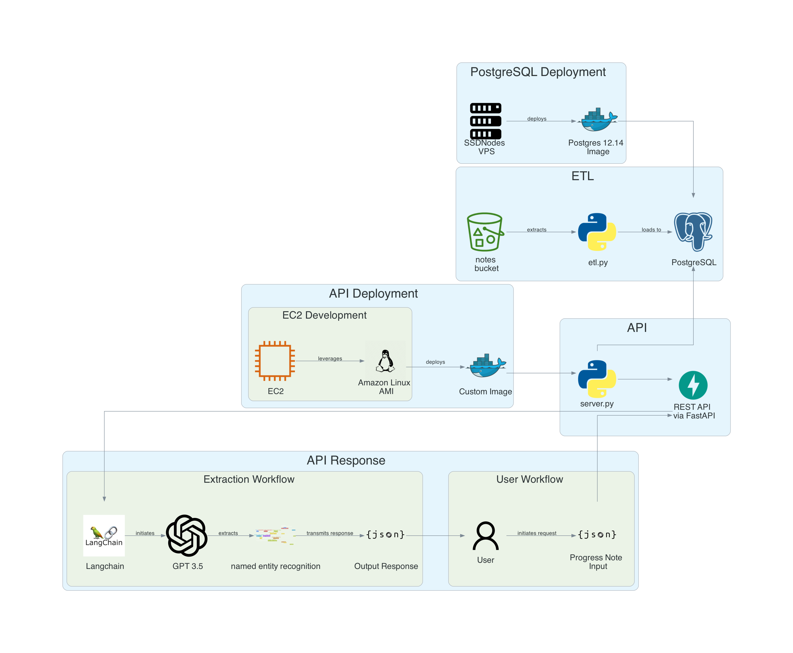

## Clinical Extraction as a Service

- [Live URL]()

### Description

The Clinical Extraction REST API Service is designed to streamline the extraction of medical information from clinical notes. Utilizing the Langchain library and GPT-3.5 for natural language understanding, the service applies named entity recognition to identify relevant information. The data flow involves an ETL (Extract, Transform, Load) process where notes are extracted, processed by `etl.py` and loaded into a PostgreSQL database. The service's API, built with Python and a high-level wrapper of FastAPI, `LangServe`,  which integrates with Langchain, handles requests and responses to facilitate the integration of clinical data extraction into various user workflows.

### Prerequisites

1. AWS account for using EC2 instances.
2. SSDNodes VPS account or equivalent for PostgreSQL deployment.
3. Access to the notes bucket for the ETL process.
4. Docker to run the PostgreSQL and API as containerized applications.

### Technologies / Frameworks

- **AWS S3**: Simple Storage Service (S3) for hosting the files related to synthetic progress notes as a cloud delivery network (CDN)
- **AWS EC2**: Hosts the API deployment with Amazon Linux AMI.
- **PostgreSQL 12.14**: Database system used for storing extracted clinical data.
- **Python**: Programming language used for the backend, including the ETL script `etl.py` and the API server `server.py`.
- **FastAPI**: Modern, fast web framework for building APIs with Python 3.7+ based on standard Python type hints.
- **Docker**: Containerization platform used to create, deploy, and run applications.
- **Langchain**: Library integrated for initiating extraction workflows with GPT-3.5.
- **Pydantic**: Library used for creating a schema of entities for the Langchain workflow to extract.
- **GPT-3.5**: AI model from OpenAI used for named entity recognition (NER) in the extraction workflow.

### Key Features

- **Extraction Workflow**: Automated process initiated by Langchain's `extraction_chain` with OpenAI's `GPT-3.5` model for intelligent entity recognition from synthetic progress notes.
- **API Deployment**: Deployed on AWS EC2 using Amazon Linux AMI for reliable access and scalability.
- **REST API**: Created with FastAPI for efficient request/response cycles with JSON exchange format, allowing easy integration into existing systems.
- **PostgreSQL Deployment**: Uses a robust and reliable PostgreSQL 12.14 image hosted on SSDNodes VPS as a container for secure data management and a relational database layer.
- **ETL Process**: Automated script extracts data from notes stored on Amazon S3, transforms it for suitability within a relational database management system (RDBMS), and loads it into the hosted PostgreSQL table called `notes`.
- **User Workflow**: Designed for ease of use, where an end user can initiate a request and receive the extracted data as a structured response.

### Architecture Diagram

### Future Steps

1. Include REST endpoints for generating patient recommendation summaries based on extracted information.

2. Creating a business intelligence layer that leverages extracted information to generate insights for improving personalized care initiatives for patients.
    - Tableau / PowerBI Dashboard
    - Web Dashboard Application (e.g. Vizro, Streamlit)

3. Include a more contextual driven workflow for really complicated medical terminology by integrating the system with vector databases / knowledge graphs.